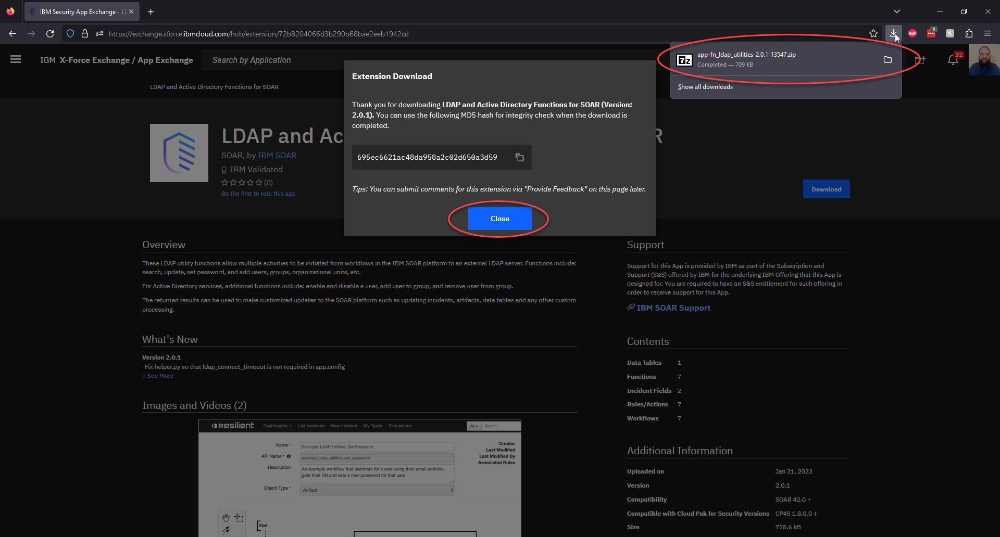
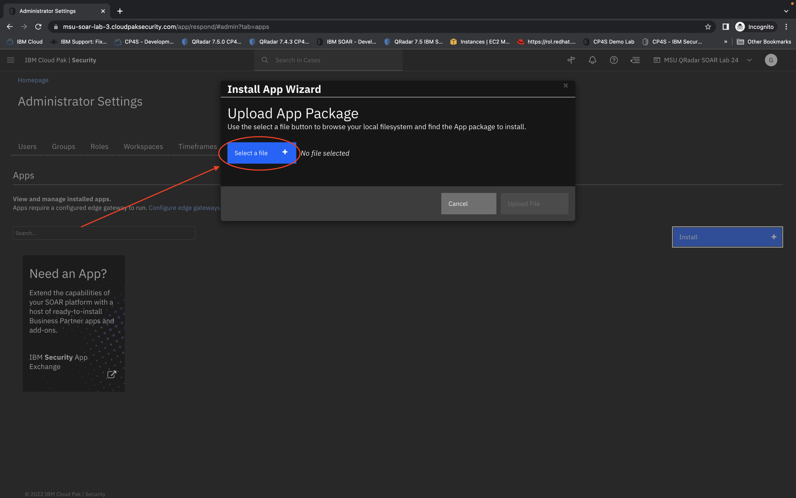
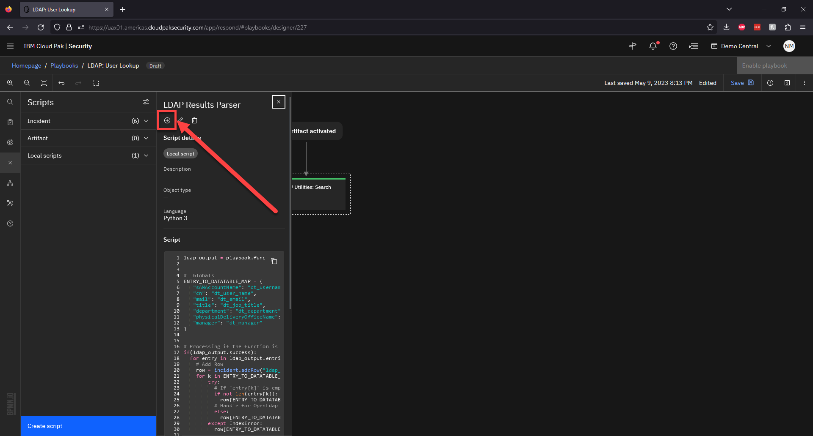
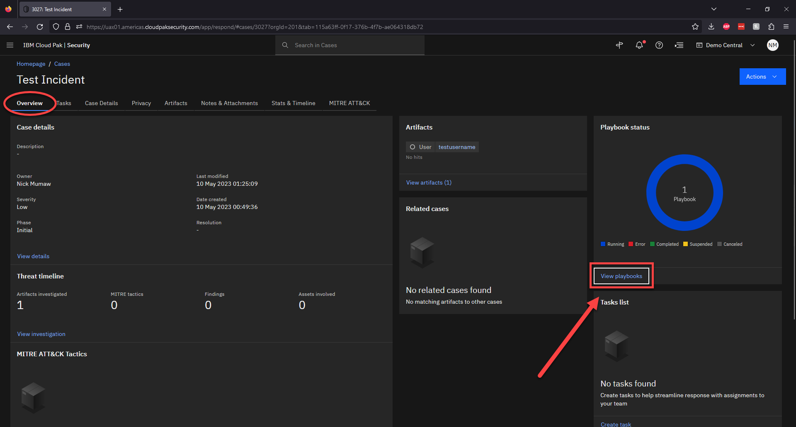

# Artifact Enrichment Playbook Lab


***Nick Mumaw & Craig Finley, Americas Technical Sales Lead, SOAR***

---

**Table of Contents:**

  - [Expectations/Requirements](#expectationsrequirements)
  - [Part I: The Set Up](#part-i-the-set-up)
      - [Installing Apps](#installing-apps)
        - [Step 1: Download LDAP and Active Directory Functions for SOAR](#step-1-download-ldap-and-active-directory-functions-for-soar-from-x-force-exchange--app-exchange)
        - [Step 2: Installing LDAP and Active Directory Functions for SOAR](#step-2-installing-ldap-and-active-directory-functions-for-soar-application)
        - [Step 3: Configure LDAP and Active Directory Functions for SOAR](#step-3-configure-ldap-and-active-directory-functions-for-soar-application)
      - [Playbook Design: Create your Automation Playbook](#playbook-design-create-your-automation-playbook)
        - [Step 4: Create Playbook Scope and Conditions](#step-4-create-playbook-scope-and-conditions)
        - [Step 5: Adding and Defining the LDAP Search Function](#step-5-adding-and-defining-the-ldap-search-function)
        - [Step 6: Creating a Parsing Script for the Results](#step-6-creating-a-parsing-script-for-the-results)
        - [Step 7: Saving and Enabling your Playbook](#step-7-saving-and-enabling-your-playbook)
      - [Layout Design: Cleaning up your system](#layout-design-cleaning-up-your-system)
        - [Step 8: Disabling Unused Rules](#step-8-disabling-unused-rules)
        - [Step 9: Adding the LDAP DataTable to your Incidents](#step-9-adding-the-ldap-datatable-to-your-incidents)
   - [Part II: Using the User Enrichment Playbook](#part-ii-using-the-user-enrichment-playbook)
      - [Bringing it All Together](#bringing-it-all-together)
        - [Step 10: Create a Sample Incident](#step-10-create-a-sample-incident)
        - [Step 11: Adding a New User Artifact](#step-11-adding-a-new-user-artifact)
        - [Step 12: Perform User Lookup using Playbook](#step-12-perform-user-lookup-using-playbook)

---

# *Expectations/Requirements*

The expectation/requirement for you to complete this Lab:

  - Access to a CP4S Case Management or Standalone SOAR Instance with AppHost connected.
    >**Note:**
    >
    >Depending on which version you have your location to settings might be different.
    >
    - Permissions to install Apps and create Playbooks with Case Management/SOAR.
  - Access to a LDAP or AD environment.

---

# **Part I: *The Set Up***

## Installing Apps

### Step 1: *Download LDAP and Active Directory Functions for SOAR from X-Force Exchange / App Exchange*

- Navigate to the IBM X-Force Exchange / App Exchange by clicking [here](https://exchange.xforce.ibmcloud.com/hub).

  

 > **Note:**
 > 
 > You will need an **IBMid** if you do not already have one to download any apps from **X-Force Exchange / App Exchange**.
 >  

- On the left hand side of the screen **Refine by** under **Products** select **SOAR**. Then, in the *Search By Application* field, start typing *LDAP* which should give you the following screen below:
 
  
  
  Click the app on the left-hand side called **LDAP and Active Directory Functions For SOAR**
  
- Once you are at the landing page for the application, select the blue **Download** button on the right-hand side:
 
   
   
- The download should begin and resemble below:

  
 
 You can close the **Extension Download** dialogue box. Now you are ready to install and configure the application.

 > **Note:**
 > 
 > The download contents will live wherever your browser defaults to. In this example, the download went to the *Downloads* folder using *Firefox* on a *Windows* computer.
 >    

---

### Step 2: *Installing LDAP and Active Directory Functions for SOAR Application*

- Once properly authenticated to XDR, you should see a screen similar to below:

  
  
 Click the three horizontal line icon in the upper left corner of the screen which should produce a large drop down menu.

- The drop down menu should look like the following:

  

 Click on **Case Management** which should produce yet another drop down menu.

- The drop down menu should look like the following:

  
 
 Click on *Permissions and access* which will bring you to the **Administrator Settings**

- Under **Administrator Settings** with the **Apps** tab selected, press the blue **Install** button:

  

- This kicks off the **Install App Wizard**. Click on the blue **Select a file** button:

  

- This prompts you to your local machines file browser where you will have to navigate to where the `app-fn_ldap_utilities-x.x.x-xxxxx.zip` was downloaded from your browser:

 

 > **Note:**
 > 
 > The application version may have changed since the time of writing this document.
 >

- Once you have selected the file, you will need to upload the file by clicking the blue **Upload File** button:

 


- Upon successful upload, the **Install App Wizard** displays the *Package Information*. You then click the blue **Next** button to continue:

 

- The **Install App Wizard** next displays the *API Key Permissions* as well as the *Package Contents* before implementing the install. Click the blue **Install** button to continue:

 
 
- Upon successful installation, you should see a screen that resembles below:

 

 You are now ready to move on and configure the *LDAP and Active Directory Functions For SOAR* application by clicking the grey **Close** button.

---

### Step 3: *Configure LDAP and Active Directory Functions For SOAR Application*

- Once closed the **Install App Wizard** should bring you to the *Details* tab of the newly downloaded application. Click onto the *Configuration* tab:

  

- The *Configuration* tab should resemble the following:

   
 
 Click on the `app.config` file to bring you to the *App Setting / app.config* screen.
 
- The *App Settings / app.config* page should resemble the following:

   
 
 Scroll to the bottom so we can point our application to our *Edge Gateway*.

- To configure the *Edge Gateway* click the **Choose edge gateway** demonstrated below:

  

- It should produce a menu drop-down with only one option. Select it.

  

 So it resembles this:
 
  	
 > **Note:**
 >
 > Your *Edge Gateway* name may be different than the example. Regardless, you should only have one option. 
 >

-  Next, you need to modify the `app.config` file itself so that it points to what you are integrating with properly. You will need to modify the following fields for the **LDAP and Active Directory Functions For SOAR**:

  

- Replace the first highlighted box so it resembles the following:
 
 ```bash
[fn_ldap_utilities]
# Ip address of the LDAP Server
ldap_server = 169.62.31.242
# Use port 636 if using ssl or port 389 if not using ssl
ldap_port = 389
ldap_use_ssl = False
# Can be ANONYMOUS, SIMPLE or NTLM
ldap_auth = NTLM
# DN of LDAP account
ldap_user_dn = CN=sa-soar,CN=Users,DC=company-lab,DC=net
# Password for the LDAP account
ldap_password = Password4Admin2
# Windows NTLM user
ldap_user_ntlm = Company-Lab\sa-soar
ldap_is_active_directory = True
ldap_connect_timeout = 30

#[fn_ldap_utilities:Domain2]
## Ip address of the LDAP Server
#ldap_server = xxx.xxx.xxx.xxx
## Use port 636 if using ssl or port 389 if not using ssl
#ldap_port = 389
#ldap_use_ssl = False
## Can be ANONYMOUS, SIMPLE or NTLM
#ldap_auth = SIMPLE
## DN of LDAP account
#ldap_user_dn = CN=Username,CN=Users,DC=example,DC=com
## Password for the LDAP account
#ldap_password = password
## Windows NTLM user
#ldap_user_ntlm = Domain\User
#ldap_is_active_directory = False
#ldap_connect_timeout = 10
 ```

>**Note:**
>
>You can supply the Password by adding a `Secret` from the *Secrets* widget on the right of the app.config code. This will allow you to hide your passwords from view and recall them using a variable.
>

- Replace the second highlighted box so that it resembles the following:
 
 ```bash
 cafile = false
 ```
 
- Last but not least, click the **Test Configuration** button. Upon successful completion, you should see the following:

  
 
 
- Next, scroll up to the top of the screen and click the blue **Save and Push Changes** button for the settings to take effect on the newly deployed application.

  
 
- After pushing those changes, you will be brought to the following screen:

  
 
 Click the *Details* tab to finish the application deployment process.
 
- Back at the *Details* tab of the application, press the grey **Deploy** button at the bottom:

  
 
-  This should then prompt the **Status** to change to *Deploying...* in the upper left corner:

  
 
- Upon successful deployment, the status will then change to *Ready For Use!*:

  
 
  The **LDAP and Active Directory Functions For SOAR** Application is now successfully installed.

---

## Playbook Design: Create Your Automation Playbook

### Step 4: *Create Playbook Scope and Conditions*

- Click the three horizontal line icon in the upper left corner which should produce a large drop down menu: 

  

- Click the menu item called **Case Management** which should produce yet another drop down menu:

  

- In that drop down menu, you will see a menu item **Playbooks**. Click it to bring you to the **Playbook Designer** page.

  

- At the **Playbooks** page, click the blue button **Create playbook** to begin creating our first playbook.

  

- Name the *Playbook*: **LDAP: User Lookup** Then click the blue button **Create**.

  

- The canvas starts with the first node asking you to *Start by selecting object type*. Under **Activation details** click the **Select an activation type** menu drop down:

  

- For this particular playbook we want to set *activation type* to **Manual**:

   

- Next, click the **Select an object type** menu drop down:

   

- Since we want the scope of the playbook to run on an *Artifact* level select **Artifact** in the menu drop down:

   

- You should see the following:

  

 Next, click the **Create condition** button.

- This will bring you to the *Create Condition* page with a default condition. Click the **Artifact ID** menu drop down under *Condition builder*.

  

- Under the drop down is also a search field. In it, begin typing *Type* which will show under the `Artifact Fields` as seen below:

  

- This bolts on another lateral menu drop down. Keep it as **is equal to** as portrayed below:

  

- This then adds on a lateral select field. Begin typing *User Account* into the field, select the **User Account** drop down option and then the blue **Done** button to finish creating our condition for our playbook.

  

- Now that our condition is set, we are now ready to create our playbook.

    

---

### Step 5: *Adding and Defining the LDAP Search Function*

- The Playbook begins with adding the function, *LDAP Utilities: Search*, to the canvas and attaching it to the starting node. To do this, Click on the icon that resembles a `f` in a circle on the left hand side depicted below:

 >**Note:**
 > 
 >Hovering the cursor over the icons tell you what each icon represents as shown.
 >

  
 
- This opens up the **Functions** view which displays a list of Apps installed. Click **SOAR LDAP Utilities** which produces a menu drop down of all of the available functions within that integration:

  

- Next, click the **+** icon next to function called **LDAP Utilities: Search** which will then bring the function object to the canvas.

  

- This then adds the **LDAP Utilities: Search** Function as node to the canvas:

  

- Rearrange the new node to below the starting point by clicking and dragging. Then connect the **Artifact activated** node to the **LDAP Utilities: Search** node so that it resembles below:

 > **Note:**
 > 
 > When you hover over a node you will see blue circles appear. By selecting one of those circles and clicking on another node you can connect one node to another.
 >

  

- Using the **LDAP Utilities: Search** function, toggle the *Functions Inputs* view to `Script` in the right pane.

  

- For our script, we will use the code below as our input script:

```py
inputs.ldap_search_param = artifact.value
inputs.ldap_search_attributes = 'SamAccountName,cn,sn,mail,telephoneNumber'
inputs.ldap_search_base = 'DC=company-lab,DC=net'
inputs.ldap_search_filter = '(&(objectclass=user)(|(SamAccountName=%ldap_param%)))'
```

  

Click the blue **Save** button to continue.

- All Functions require an output name whether it gets used or not. Name the Output name: `ldap_search_output` as shown below:

  

---

### Step 6: *Creating a Parsing Script for the Results*

- Next, click on the icon, `</>`, that represents **Scripts** as shown below that will open up a menu view:
 
  

- Click the **Create script** to start a new script for your playbook.
 
  

- Because this script will likely **NOT** be used within other playbooks, let's keep this script as a **Local** *Script scope* and set the *Script name* as **LDAP Results Parser**.
 
  

- Copy and Paste the following Python code into the *Code* section at the bottom of the *Create Script* page.

```py
ldap_output = playbook.functions.results.ldap_search_output


#  Globals
ENTRY_TO_DATATABLE_MAP = {
   "sAMAccountName": "dt_username",
   "cn": "dt_user_name",
   "mail": "dt_email",
   "title": "dt_job_title",
   "department": "dt_department",
   "physicalDeliveryOfficeName": "dt_location",
   "manager": "dt_manager"
}


# Processing if the function is a success
if(ldap_output.success):
  for entry in ldap_output.entries:
    # Add Row
    row = incident.addRow("ldap_query_results")
    for k in ENTRY_TO_DATATABLE_MAP:
        try:
          # If 'entry[k]' is empty
          if not len(entry[k]):
            row[ENTRY_TO_DATATABLE_MAP[k]] = "N/A"
          # Handle for OpenLdap
          else:
            row[ENTRY_TO_DATATABLE_MAP[k]] = entry[k]
        except IndexError:
          row[ENTRY_TO_DATATABLE_MAP[k]] = "N/A"
```

  

Once that the script is completed, click the blue **Create** button.

- Add the script to the canvas by clicking the **+** button under *LDAP Results Parser* script name.

  

- Rearrange the new script below the **LDAP Utilities: Search** function node. Then link the *Function* to the *Script* as shown below:

  

 - Click the icon with 3 squares connected with an arrow pointing at them that represents the **Decision points** as shown below which will open up a menu view:
 
  
 
- Click the **+** icon opposite the **End point** to add it to the canvas, then rearrange the **Endpoint** below the **Automatic Close** script and attach it:
 
  

- Now we have completed the structure for our **LDAP: User Lookup** Playbook. Here represents a birds eye view of our flow:
 
  

---

### Step 7: *Saving and Enabling your Playbook*

- After completing the playbook build we have 1 final step, Save and Enable your playbook. Those can be done by choosing the options in the top right, **Save** with the save disk icon and then clicking the blue **Enable playbook** button:
 
  

- Once your playbook has been *Enabled* you will see it change from a **draft** to **active**
 
  
  

---

## Layout Design: Cleaning up your system

### Step 8: *Disabling Unused Rules*

- Click the icon in the upper left most corner of the screen to produce the main **Menu** drop down:
 
  

- From there under *Application Settings*, select **Case Management** and then **Customization**:
 
  

- When in the **Customization Settings**, select the **Rules** tab.

  

- In the search bar, enter **Example**:

  

- Toggle each of the rules listed from off to on to look like the image below:

  

You should now have cleaned up extra rules that will run or show up in menus that are not needed.

---

### Step 9: *Adding the LDAP DataTable to your Incidents*

- To change the over all layout of an incident, we must go into the **Customization Settings** by clicking the icon in the upper left most corner of the screen to produce the main **Menu** drop down:

  

- From there under *Application Settings*, select **Case Management** and then **Customization**:
 
  

- Then access the *Incident Tabs* by clicking the 2nd tab on the left marked **Incident Tabs**

  

- Once here, go into the *Artifact Tab* by choosing **Artifacts** in the available tabs on the left.

  

- From here we will add the **LDAP Query results** Data Table by dragging and dropping the *Data Table* object on the right to the *Artifacts Tab* canvas in the middle as shown below:

  

After click the Blue **Save** button, the next time you load an incident you will see the **LDAP Query results** data table in the **Artifacts** tab.

---

# **Part II:** *Using the User Enrichment Playbook*

## Bringing It All Together

Now that your playbook is complete, we will use it to lookup a user from our demo LDAP System.

### Step 10: *Create a Sample Incident*

- From the `Homepage`, Select the **Case Management** application.

  

- Click the blue **Create case  +** button to manually start a new case:

  

- Go through the **Create Case Manual Wizard** being sure to fill out anything marked with a red asterisk, <span style="color:red">*</span>, which means it is required.

  

---

### Step 11: *Adding a new User Artifact*

- Once in the case, you will land on the *Overview* page of the **Case**:

  
 
Click on the *Artifacts* tab next.

- In the *Artifacts* table, Select the blue **Add Artifact   +** button.

  

- Search the available *Artifact Types* for **User Account**.  

  

- Enter the value below as the username to use for testing.

>CraigF

  

 Now finalize the creation of the *Artifact* with the **Create** button.

---

### Step 12: *Perform User Lookup using Playbook*

- Use the vertical ellipsis, **...**, menu icon next to the new *User Account Artifact* to select the **LDAP: User Lookup** playbook.  

  

- You will then see a dialogue box stating that the playbook, **LDAP: User Lookup**, was successfully executed:  

  

- Check the *Overview* tab to view the status of the playbook.

  
  

- Finally, once the playbook has finished, you will be able to see the user's queried information in the *Artifacts* tab on the **LDAP Query results**:

   
